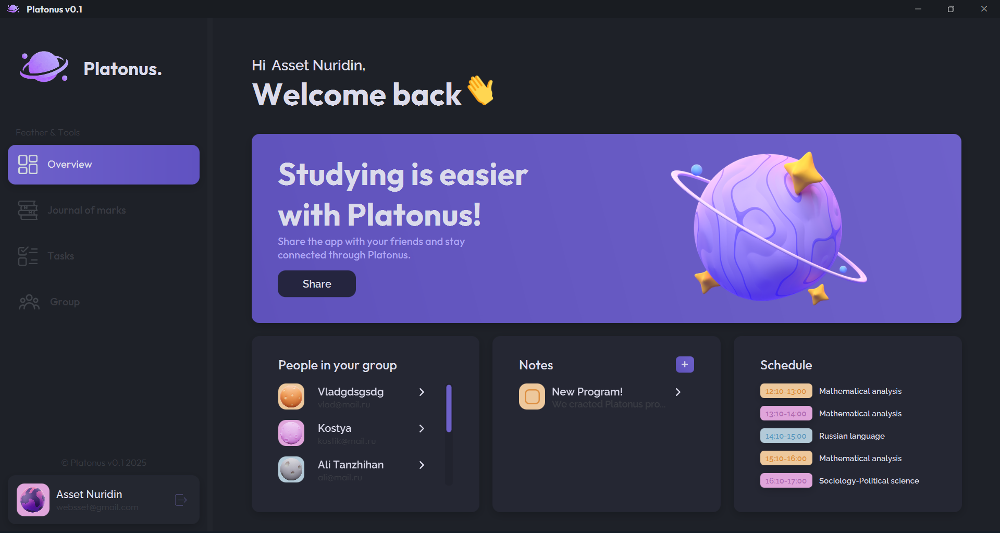
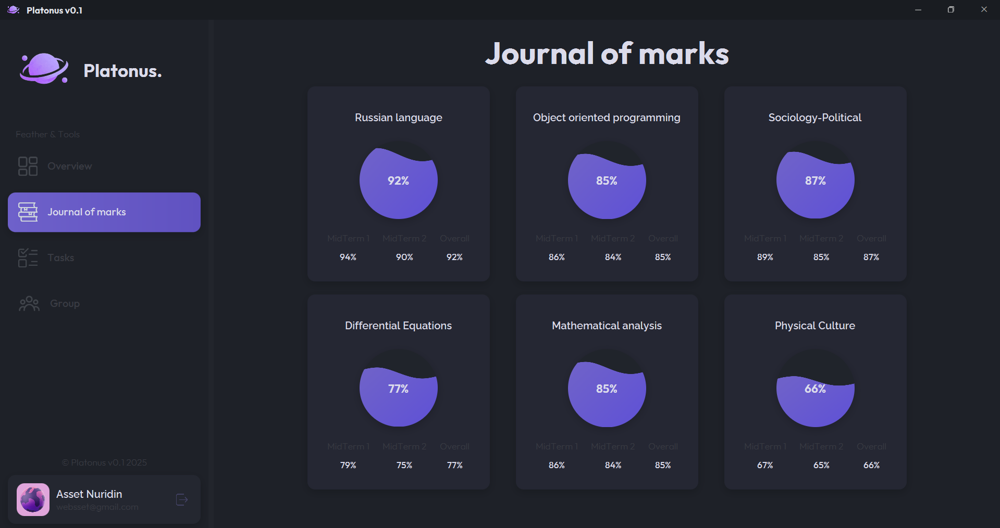
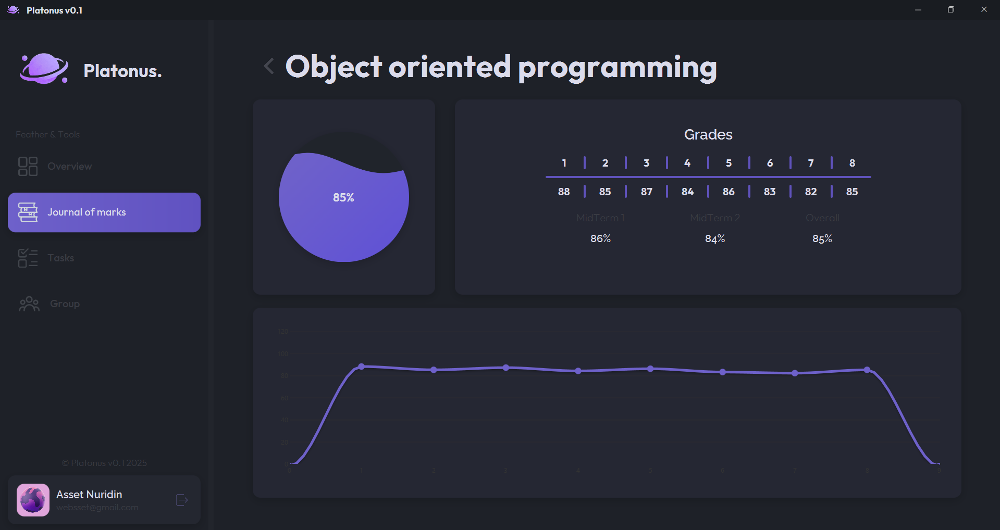

# Platonus

## 📌 Description
Platonus is a smart platform designated for students to manage their academic life efficiently. It acts as a comprehensive student management system, helping you track grades, schedules, assignments, and stay connected with your university network.

---

## ⚙️ Features

- **User Authentication**: Secure registration and login system handling user profiles.
- **Interactive Dashboard**: A dynamic home screen displaying your profile, schedule, and notifications.
- **Smart Schedule**: Automatically displays your class schedule for the current day.
- **Notes Manager**: Create, edit, and manage your personal study notes and to-do lists.
- **Classmate Connectivity**: View your classmates (visualized as planetary icons) and connect with them.
- **Chat System**: Integrated messaging to communicate with peers.
- **Modern UI/UX**: A visually engaging interface built with JavaFX, featuring smooth animations and a space-themed design.

---

## 🛠 Technology Stack

- **Java 25**: Core programming language.
- **JavaFX**: Framework for building the rich desktop user interface.
- **Maven**: Dependency management and build tool.
- **PostgreSQL**: Relational database for storing user data, friends, and chat history.

---

## 📸 Screenshots

### Main Window


### journal Window



---

### Prerequisites

- Java Development Kit (JDK) 25 or higher.
- Maven installed.

### 🚀 Installation & Run

1.  **Clone the repository:**
    ```bash
    git clone <repository-url>
    cd gitplatouns
    ```

2.  **Build the project:**
    ```bash
    mvn clean install
    ```

3.  **Run the application:**
    ```bash
    mvn javafx:run
    ```

## Configuration

The application automatically creates a local cache directory to store session data and local notes. Ensure your user has write permissions to this path.

## Project Structure

- `src/main/java`: Source code for the application.
  - `Launcher.java`: Main entry point.
  - `MainController.java`: Logics for the main dashboard.
  - `LogRegController.java`: Handles authentication.
  - `Connect.java`: Database connection configuration.
- `src/main/resources`: FXML layout files and assets (images, styles).
